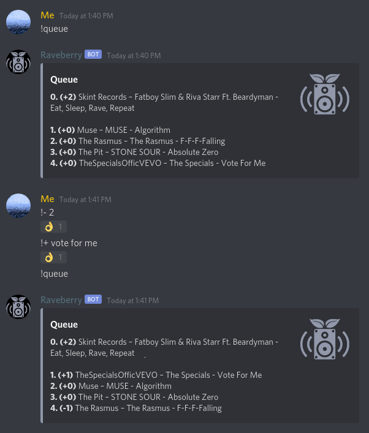

# Raveberry for Discord

This Discord Bot that allows you to democratically select the music on your server. It controls your [Raveberry](https://github.com/raveberry/raveberry) instance.



## Prerequisites

1. A running [Raveberry](https://github.com/raveberry/raveberry) instance
	* Streaming has to be enabled
	* Voting mode should be enabled
	* It needs to be available from the machine you run this bot from (ideally the same machine)
2. A Discord account
3. A Discord server you can add bots to

## Installation

##### 1. Create the Bot

Since your Raveberry instance is probably not publicly available, I can not provide you with a bot that you can simply invite to your server. Instead, you have to create your own:

* Go to https://discord.com/developers/applications
* Create Application "Raveberry"
* (Optional: set app icon to [this image](https://github.com/raveberry/raveberry/blob/master/static/graphics/raveberry_square.png))


* Go to Bot
* Create Bot "Raveberry"
* Press "Copy" to put token into clipboard
* Paste it somewhere (you will need it later)


* Go to OAuth2
* Select Scope "bot"
* Select Permissions:
	* Text Permissions:
		* Send Messages: Respond to commands
		* Add Reactions: Acknowledge commands
	* Voice Permissions:
		* Connect: Join voice channels
		* Speak: Play music in a voice channel
* Copy the url
* Paste it into a new tab
* Click through the authorization to add your bot to the server

Refer to [this guide](https://discordpy.readthedocs.io/en/latest/discord.html) for more information.

##### 2. Configure the application

Clone this repository or download the files manually (you need `raveberry.py`, `requirements.txt` and `config.ini`)

```
python3 -m venv .venv
. .venv/bin/activate
pip3 install -r requirements.txt
```

Next you need to fill in the necessary information in the .ini file:
```
[Discord]
# The token of the bot you created
token = <the bot token you copied earlier>
# The prefix that has to be put in front of all commands
# If you already have another bot with this prefix you should change it to another character
prefix = !

[Raveberry]
# The hostname and port of your Raveberry instance
# "localhost", IP or a DNS-resolvable name can all be given as a hostname
hostname = localhost
# With a system install, use port 80. A user install uses port 8080.
port = 80

[Stream]
# The hostname and port where Raveberry streams its audio
# This is most likely the same hostname, but the port might differ
hostname = localhost
# A system install uses port 80. A user install should use port 8000 and communicate with icecast directly.
port = 80
# Username and password of your stream.
# Default is "raveberry" and "raveberry"
# If authentication is disabled, delete everything after the "="
username = raveberry
password = raveberry
```

#####  3. Run it

Run the bot with `python3 raveberry.py`. It should log in automatically to Discord.
You can check if it is working with the `!help` command.

##### 4. Make the bot start automatically on boot (optional)

Currently the bot will stop working if the script execution stops. In order to automatically start up the bot after the next system reboot, you can add a systemd unit. An example file is given in `raveberry_discord.service`. Change both the user to your actual one and the path to the one you downloaded the files to (three occurences). Then install the service like this:
```
sudo cp raveberry_discord.service /etc/systemd/system/
sudo systemctl daemon-reload
sudo systemctl enable raveberry_discord
```

## Usage

The bot supports the following commands:
```
help                        Show this message
join                        Make the bot enter your voice channel
leave                       Make the bot leave its voice channel
play/push/enqueue           Add the given song (link or search query) to the queue
queue/q                     Show the current queue
vote_up/voteup/up/+         Vote up a song (by index or name)
vote_down/votedown/down/-   Vote down a song (by index or name)
reload/refresh              Reload the audio stream
```
Enter a voice channel and type `!join` to make the bot enter your voice channel. It will automatically start streaming audio from raveberry. View the queue with `!queue` and add new songs with `!play`. Vote songs with `!+ <song>` and `!- <song>`. Songs are identified by either their index or their names (any case-insensitive substring will do).

This should be enough to have an enjoyable experience. All further configuration can still take place through the web interface of Raveberry.

## Troubleshooting
If Raveberry has no songs to play, the bot will play silence. However, it has problems catching up when songs are playing again. It might take 1-2 minutes for it to start playing the next song. Use `!refresh` to restart the audio stream so you don't have to wait.

Make sure Raveberry is running at that it can play music. Also make sure that streaming works by opening the stream in your browser.
Check the logs of the related services:
```
journalctl -xeu raveberry_discord
journalctl -xeu mopidy
journalctl -xeu icecast2
journalctl -xeu daphne
```
Sometimes the services just need a restart with `systemctl restart <service>`, e.g. when mopidy can't connect to icecast with `GStreamer error: Could not write to resource`.

Note that the following error is unproblematic:
```
[mp3float @ <some address>] Header missing
Error while decoding stream #0:0: Invalid data found when processing input
```
Apparently some metadata is missing in the audio stream, but the music still plays fine.

Don't hesitate to mail me for feedback or open an issue if you experience any problems.
